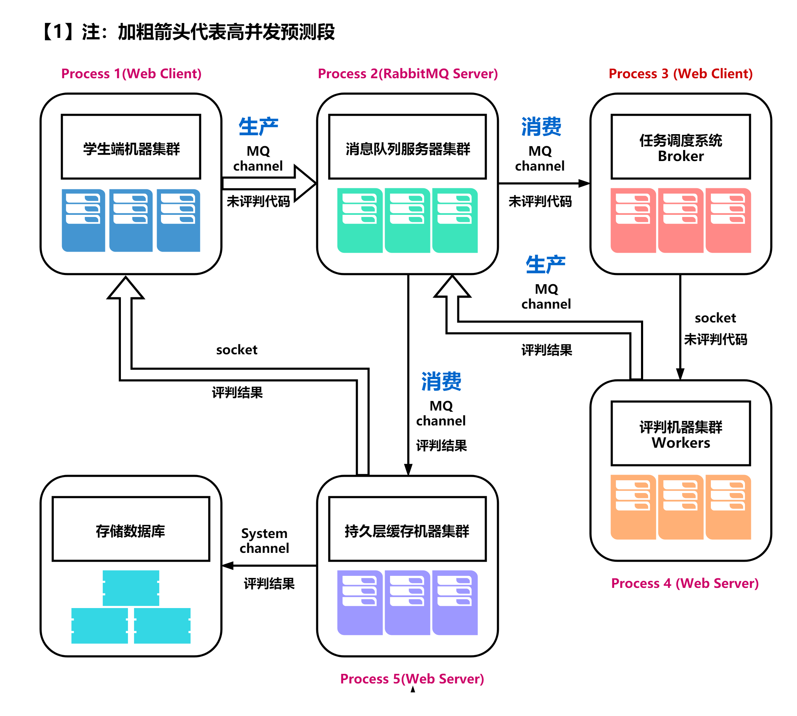
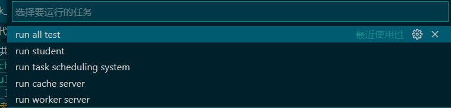
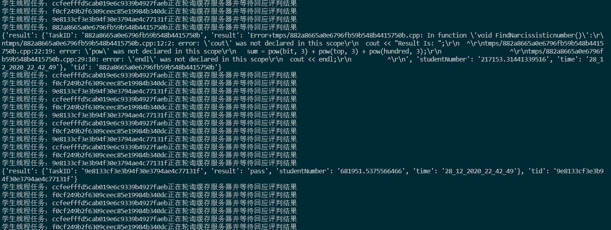

# Project: POLO-OJ (python)
# POLO 代码在线评判系统
---
> Jintu Zheng 2020-12-28

## 1. 场景描述
实验课上多台学生端的机器并发向服务端提供自己的代码，服务器评判正确和错误，需要把评判结果返回给学生并且把学生提交的代码和最后的结果写入数据库。

学生端机器不间断产生代码提交并异步轮询缓存服务器的评判结果。

## 2. 架构图


## 3. 文件说明
整个分布式系统共有5个进程，对应的程序文件分别是:
- `student_machine.py` 学生客户端（可以提交代码）
- `task_scheduling_system.py` 资源调度系统进程
- `persistent_layer_cache_machine.py` 持久化缓存服务器（数据库写入的部分没完成）后期可以考虑数据库索引缓存
- `worker_machine.py` 评判系统进程

你可以书写脚本对学生进程多开并发，或者每个学生的线程并行，然后模拟的评判系统进程的线程数量可以自由设置。

每个文件注释都非常详细了，可以自行查阅。


## 4. 安装依赖
- Erlang (装了Erlang才能装RabbitMQ)
- RabbitMQ （消息队列服务器）
- G++（用于评判编译器）
- request (python)
- flask (python)
- pika (python)

## 4. 演示

本工程IDE：vscode

打开工程，启动`run all test`:



我们的终端将启动5个进程，当然如果觉得一个学生端不爽的话，可以选择：`run cool test`

这样我们就会运行 4个学生端，1个调度服务器，1个评判服务器，1个持久缓存服务器


每个学生端在下面代码处：可以设置每个学生客户端的进程的线程数
```python
Threads_limit = 4 # 该学生的机器单一进程能一次性最多提交4份代码
```

下面是演示：



当学生提交代码之后，代码可能正确，那么得到的结果是pass，如果是错误的话就会返回编译错误的信息。如果消息没有到达，那么则继续轮询缓存服务器